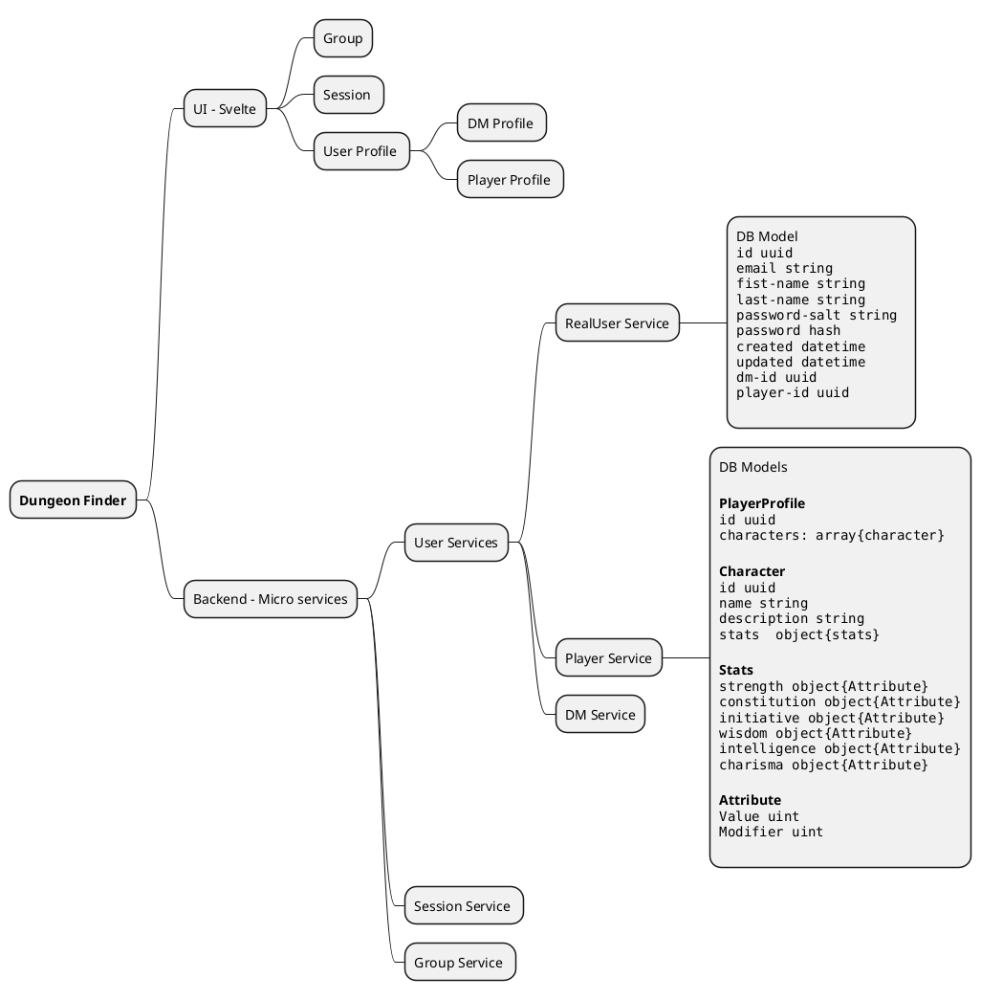

# DungeonFinder 

Dungeon finder is both a fancy technical Hello-World combined with the attempt to create a Full Stack application to manage real-life DnD Groups and Sessions. 

The use case comes from the lack of a german real-life group manager combined with some technical playground to create a few microservices to learn and practise language that I / we dont use professionally such as Rust, Golang or Svelte. Moreover we will also play around with different technologies and figure out where advantages and disadvantages are first hand instead of always trusting the documentation. 

